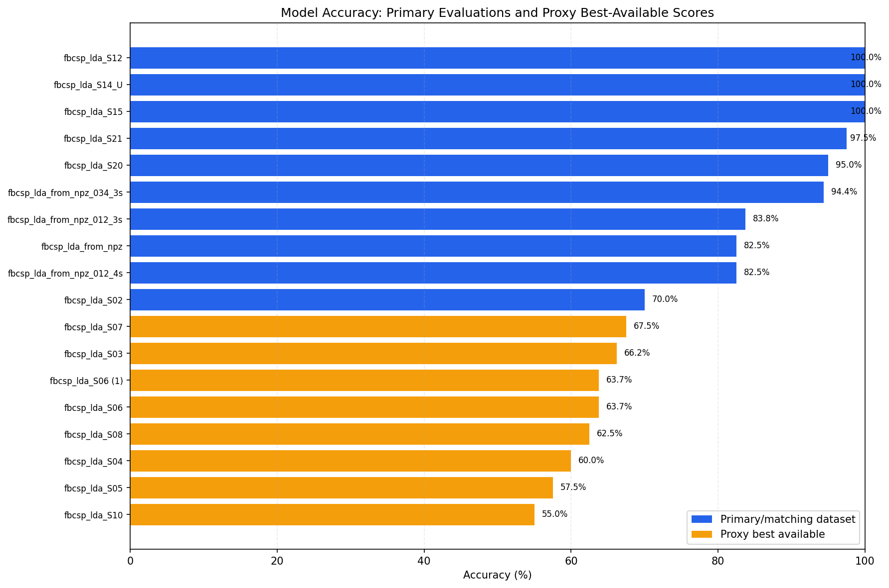
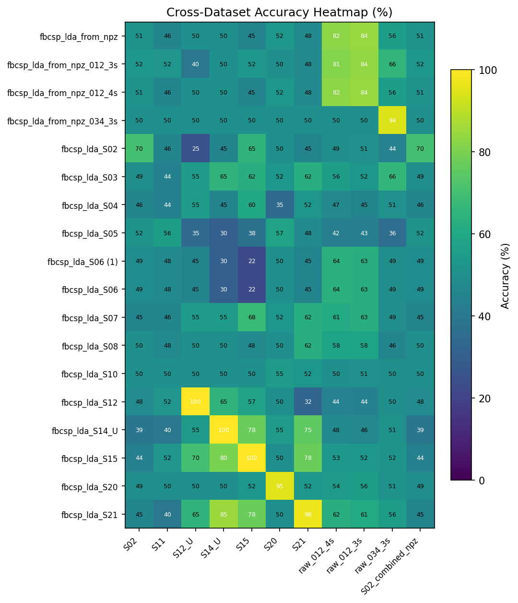
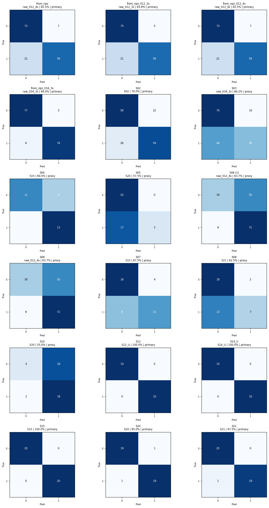

# FBCSP+LDA Model Evaluation Report

Generated from the current workspace models and datasets.

## Method

- Loaded every `*.joblib` model in the project root using `src.fbcsp.FBCSP.load`.
- Evaluated each model on all compatible 3-channel binary datasets found under `data/`.
- Primary accuracy uses the matching subject dataset when available. For `from_npz` models, the primary dataset is inferred from the filename channel/crop suffix.
- Models without an available matching dataset are reported with a proxy best-available score. Treat proxy scores as cross-dataset checks, not true subject accuracy.
- Labels are interpreted as `0 = rest`, `1 = hand_mi`, matching the project data metadata.
- Runtime scikit-learn version: `1.7.2`.

## Persistence Warnings

Some models were saved with a different scikit-learn version than the current environment. The models loaded, but scikit-learn warns that old pickled estimators can produce compatibility risks.

## Dataset Inventory

| Dataset | Shape | Labels | Notes |
|---|---:|---:|---|
| S02 | `(160, 3, 2000)` | `{0: 80, 1: 80}` | subject epoch/label files |
| S11 | `(50, 3, 2000)` | `{0: 25, 1: 25}` | subject epoch/label files |
| S12_U | `(20, 3, 2000)` | `{0: 10, 1: 10}` | subject epoch/label files |
| S14_U | `(20, 3, 2000)` | `{0: 10, 1: 10}` | subject epoch/label files |
| S15 | `(40, 3, 2000)` | `{0: 20, 1: 20}` | subject epoch/label files |
| S20 | `(40, 3, 2000)` | `{0: 20, 1: 20}` | subject epoch/label files |
| S21 | `(40, 3, 2000)` | `{0: 20, 1: 20}` | subject epoch/label files |
| raw_012_4s | `(160, 3, 2000)` | `{0: 80, 1: 80}` | raw NPZ channels 0,1,2, 4s |
| raw_012_3s | `(160, 3, 1500)` | `{0: 80, 1: 80}` | raw NPZ channels 0,1,2, first 3s |
| raw_034_3s | `(160, 3, 1500)` | `{0: 80, 1: 80}` | raw NPZ channels 0,3,4, first 3s |
| S02_combined_npz | `(160, 3, 2000)` | `{0: 80, 1: 80}` | S02 combined NPZ full 4s |

## Selected Model Accuracy

- Primary/matching evaluations: 10
- Proxy best-available evaluations: 8

| Model | Dataset | Type | Accuracy | Balanced Accuracy | Trials | Confusion Matrix | Notes |
|---|---|---|---:|---:|---:|---|---|
| `fbcsp_lda_S02.joblib` | S02 | primary | 70.0% | 70.0% | 160 | [fbcsp_lda_S02__S02__primary.png](confusion_matrices/fbcsp_lda_S02__S02__primary.png) | matching subject dataset |
| `fbcsp_lda_S12.joblib` | S12_U | primary | 100.0% | 100.0% | 20 | [fbcsp_lda_S12__S12_U__primary.png](confusion_matrices/fbcsp_lda_S12__S12_U__primary.png) | closest available subject dataset (S12_U) |
| `fbcsp_lda_S14_U.joblib` | S14_U | primary | 100.0% | 100.0% | 20 | [fbcsp_lda_S14_U__S14_U__primary.png](confusion_matrices/fbcsp_lda_S14_U__S14_U__primary.png) | matching subject dataset |
| `fbcsp_lda_S15.joblib` | S15 | primary | 100.0% | 100.0% | 40 | [fbcsp_lda_S15__S15__primary.png](confusion_matrices/fbcsp_lda_S15__S15__primary.png) | matching subject dataset |
| `fbcsp_lda_S20.joblib` | S20 | primary | 95.0% | 95.0% | 40 | [fbcsp_lda_S20__S20__primary.png](confusion_matrices/fbcsp_lda_S20__S20__primary.png) | matching subject dataset |
| `fbcsp_lda_S21.joblib` | S21 | primary | 97.5% | 97.5% | 40 | [fbcsp_lda_S21__S21__primary.png](confusion_matrices/fbcsp_lda_S21__S21__primary.png) | matching subject dataset |
| `fbcsp_lda_from_npz.joblib` | raw_012_4s | primary | 82.5% | 82.5% | 160 | [fbcsp_lda_from_npz__raw_012_4s__primary.png](confusion_matrices/fbcsp_lda_from_npz__raw_012_4s__primary.png) | primary inferred from default train_from_npz picks 0,1,2 full 4s |
| `fbcsp_lda_from_npz_012_3s.joblib` | raw_012_3s | primary | 83.8% | 83.8% | 160 | [fbcsp_lda_from_npz_012_3s__raw_012_3s__primary.png](confusion_matrices/fbcsp_lda_from_npz_012_3s__raw_012_3s__primary.png) | primary inferred from filename: raw NPZ channels 0,1,2 cropped to 3s |
| `fbcsp_lda_from_npz_012_4s.joblib` | raw_012_4s | primary | 82.5% | 82.5% | 160 | [fbcsp_lda_from_npz_012_4s__raw_012_4s__primary.png](confusion_matrices/fbcsp_lda_from_npz_012_4s__raw_012_4s__primary.png) | primary inferred from filename: raw NPZ channels 0,1,2 full 4s |
| `fbcsp_lda_from_npz_034_3s.joblib` | raw_034_3s | primary | 94.4% | 94.4% | 160 | [fbcsp_lda_from_npz_034_3s__raw_034_3s__primary.png](confusion_matrices/fbcsp_lda_from_npz_034_3s__raw_034_3s__primary.png) | primary inferred from filename: raw NPZ channels 0,3,4 cropped to 3s |
| `fbcsp_lda_S03.joblib` | raw_034_3s | proxy_best_available | 66.2% | 66.2% | 160 | [fbcsp_lda_S03__raw_034_3s__proxy_best_available.png](confusion_matrices/fbcsp_lda_S03__raw_034_3s__proxy_best_available.png) | No matching primary dataset found; using best available compatible dataset (raw_034_3s) as proxy. |
| `fbcsp_lda_S04.joblib` | S15 | proxy_best_available | 60.0% | 60.0% | 40 | [fbcsp_lda_S04__S15__proxy_best_available.png](confusion_matrices/fbcsp_lda_S04__S15__proxy_best_available.png) | No matching primary dataset found; using best available compatible dataset (S15) as proxy. |
| `fbcsp_lda_S05.joblib` | S20 | proxy_best_available | 57.5% | 57.5% | 40 | [fbcsp_lda_S05__S20__proxy_best_available.png](confusion_matrices/fbcsp_lda_S05__S20__proxy_best_available.png) | No matching primary dataset found; using best available compatible dataset (S20) as proxy. |
| `fbcsp_lda_S06 (1).joblib` | raw_012_4s | proxy_best_available | 63.7% | 63.7% | 160 | [fbcsp_lda_S06_1__raw_012_4s__proxy_best_available.png](confusion_matrices/fbcsp_lda_S06_1__raw_012_4s__proxy_best_available.png) | No matching primary dataset found; using best available compatible dataset (raw_012_4s) as proxy. |
| `fbcsp_lda_S06.joblib` | raw_012_4s | proxy_best_available | 63.7% | 63.7% | 160 | [fbcsp_lda_S06__raw_012_4s__proxy_best_available.png](confusion_matrices/fbcsp_lda_S06__raw_012_4s__proxy_best_available.png) | No matching primary dataset found; using best available compatible dataset (raw_012_4s) as proxy. |
| `fbcsp_lda_S07.joblib` | S15 | proxy_best_available | 67.5% | 67.5% | 40 | [fbcsp_lda_S07__S15__proxy_best_available.png](confusion_matrices/fbcsp_lda_S07__S15__proxy_best_available.png) | No matching primary dataset found; using best available compatible dataset (S15) as proxy. |
| `fbcsp_lda_S08.joblib` | S21 | proxy_best_available | 62.5% | 62.5% | 40 | [fbcsp_lda_S08__S21__proxy_best_available.png](confusion_matrices/fbcsp_lda_S08__S21__proxy_best_available.png) | No matching primary dataset found; using best available compatible dataset (S21) as proxy. |
| `fbcsp_lda_S10.joblib` | S20 | proxy_best_available | 55.0% | 55.0% | 40 | [fbcsp_lda_S10__S20__proxy_best_available.png](confusion_matrices/fbcsp_lda_S10__S20__proxy_best_available.png) | No matching primary dataset found; using best available compatible dataset (S20) as proxy. |

## Graphs

## Files Produced

- `primary_model_accuracy.csv`: selected primary/proxy result per model.
- `best_available_accuracy.csv`: highest compatible dataset score per model.
- `cross_dataset_accuracy.csv`: full model-by-dataset accuracy matrix in long CSV format.
- `confusion_matrices.json`: exact selected confusion matrix values.
- `dataset_inventory.json`: datasets used for evaluation.
- `confusion_matrices/`: individual confusion matrix PNGs.
- `figures/`: aggregate graphs.
